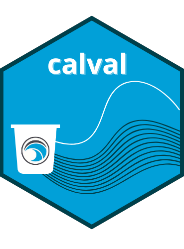
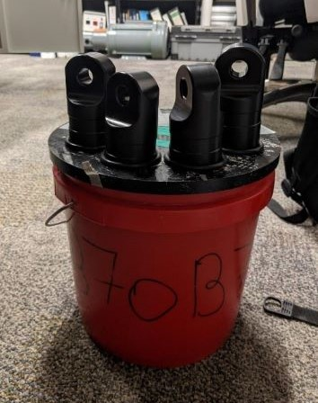
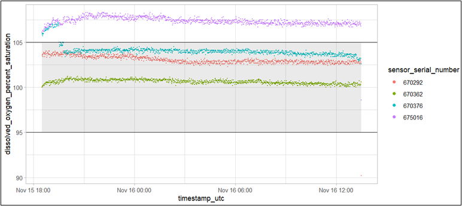

<!-- README.md is generated from README.Rmd. Please edit that file -->

```{r, include = FALSE}
knitr::opts_chunk$set(
  collapse = TRUE,
  comment = "#>",
  fig.path = "man/figures/README-",
  out.width = "100%",
  dpi = 600
)

library(badger)
library(dplyr)
library(glue)
library(kableExtra)

repo <- "ntorrie/calval"
```

# calval

```{r, echo=FALSE, out.width="25%", fig.align='center'}

```


<!-- badges: start -->
[](https://www.gnu.org/licenses/gpl-3.0)
[](https://github.com/ntorrie/calval/actions/workflows/R-CMD-check.yaml)
<!-- badges: end -->

The `calval` package contains a collection of functions to assist with the flagging and visualization of validation data collected during quality assurance testing of CMAR Coastal Monitoring Program sensors. Sensor testing occurs prior to sensor deployment to ensure sensors are recording within an appropriate range. Testing is repeated after sensors are retrieved from deployment to check for sensor drift and biofouling impacts. 

`calval` is compatible with the following sensor models:

Table 1. Compatible Sensor Models
```{r, echo = FALSE,caption = "Compatible Sensor Models"}
tibble(
  SENSORS = c(
    "aquaMeasure DOT", 
    "aquaMeasure SAL",
    "Vemco VR2AR & VR2AR-X",
    "Hobo DO U26-001",
    "Hobo Temp U22-001"
  ),
  urls = c(
    "https://www.innovasea.com/wp-content/uploads/2023/12/AQI_Spec_Sheet.08.12.23.pdf",
    "https://www.innovasea.com/wp-content/uploads/2023/12/AQI_Spec_Sheet.08.12.23.pdf",
    "https://go.innovasea.com/vr2ar_manual.pdf",
    "https://www.onsetcomp.com/resources/documentation/15603-e-man-u26x",
    "https://www.onsetcomp.com/resources/documentation/21537-mx2203-and-mx2204-manual"
  ),
  `Variable(s) Measured` = c(
    "Temperature, Dissolved Oxygen Percent Saturation",
    "Temperature, Salinity",
    "Temperature", 
    "Temperature, Dissolved Oxygen mg/L", 
    "Temperature"
  )
) %>%
  mutate(Sensor = glue::glue("[{SENSORS}]({urls})")) %>%
  select(Sensor, `Variable(s) Measured`) %>%
  kable(align = "ll", format = "pipe")
```


## Installation

You can install the development version of `calval` from [GitHub](https://github.com/) with:

``` r
# install.packages("devtools")
devtools::install_github("ntorrie/calval")
```

## Pre-Deployment Validation Tests
Prior to deployment, sensors that can be calibrated are calibrated according to their specific sensor manual. Each sensor is then subjected to a validation test(s), which differ depending on the variables measured.

### Test 1
The first validation test (Test 1) evaluates accuracy of dissolved oxygen percent saturation measurements. For a validation test of dissolved oxygen measured in units of percent saturation, sensors are set to record at 10 minute intervals and placed in an air-tight environment with water-saturated air at 100 % humidity. The sensors are left to record for a minimum of 6 hours (Figure 1). Upon completion of the validation tests, data from each sensor is offloaded and evaluated using the `calval` package functions.

```{r, echo=FALSE, out.height='50%', out.width='50%', fig.align='center', dpi=600}

```
Figure 1. Dissolved oxygen percent saturation test (Test 1)
<br>
<br>

The precision for these dissolved oxygen sensors is +/-5 % (InnovaSea 2021). Since the the sensors in the test environment are in water-saturated air, they should measure 100 +/-5 % saturation. Any sensors which record observations outside of the acceptable 95 - 105 % range for > 10 % of the test duration require re-calibration and re-validation. If a sensor fails more than 2 consecutive validation tests it will be sent back to the manufacturer for troubleshooting. Sensors that pass the tests are cleared for deployment. 


```{r, echo=FALSE, out.height='120%', out.width='100%', fig.align='center', dpi=600}

```
Figure 2. Visualizing results of a dissolved oxygen percent saturation test for four sensors. Sensor 675016 recorded outside of an acceptable range for 99.9% of the test period, and was therefore flagged for re-calibration and further testing.

### Test 2a or 2b
The second validation test evaluates accuracy of temperature, dissolved oxygen mg/L (when applicable), and salinity (when applicable) measurements. If no salinity sensors are present in the test batch, all sensors undergo Test 2a only. If salinity sensors are present in the test batch, all sensors undergo Test 2b only. 

For validation Test 2a (temperature and dissolved oxygen measured in mg/L (where applicable)), sensors are set to record at 10 - 15 minute intervals and submerged in a well insulated tank of fresh water for a minimum of 12 hours. For validation Test 2b (temperature, salinity, and dissolved oxygen measured in mg/L (where applicable)), the same test setup and duration is used as test 2a, except sea water is used instead of fresh water. A minimum of 4 sensors are required in the test batch to ensure a valid test for both test 2a and 2b. When possible, a mix of sensor types are included in each test batch.

Upon completion of Test 2a or 2b, data from each sensor is offloaded and evaluated using the `calval` package functions. For each variable, an acceptable sensor observation should fall within the range of median observation +/- the sensor-specific precision range. The precision for each sensor type varies slightly. Any sensor that records outside of the acceptable range for > 10 % of the test duration will be re-calibrated (if applicable) and re-validated. If a sensor fails more than 2 consecutive validation tests it will be sent back to the manufacturer for troubleshooting. Sensors that pass the tests are cleared for deployment.


## Post-Deployment Validation Tests
After sensors are retrieved from deployment, they undergo post-deployment validation testing following the same procedures as the pre-deployment validation tests. Results from the post-deployment validation tests indicate whether the sensor data retrieved during the sensor deployment may have been impacted by sensor drift or biofouling.


## Validation Test Summary Table
Table 2. Validation Test Details
```{r, echo=FALSE,caption= "Validation Test Details"}
tibble(
  Test = c(
    "Test 1", 
    "Test 2a",
    "Test 2a",
    "Test 2b",
    "Test 2b",
    "Test 2b"
  ),
  `Test Environment` = c(
    "Air-tight environment with water saturated air at 100% humidity. Sensors not submerged.",
    "Insulated tank of fresh water. Sensors fully submerged.",
    "Insulated tank of fresh water. Sensors fully submerged.",
    "Insulated tank of sea water. Sensors fully submerged.",
    "Insulated tank of sea water. Sensors fully submerged.",
    "Insulated tank of sea water. Sensors fully submerged."
  ),
  `Minimum Test Duration` = c(
    "6 hours",
    "12 hours",
    "12 hours",
    "12 hours",
    "12 hours",
    "12 hours"
  ),
  `Variable(s) Tested` = c(
    "dissolved oxygen",
    "temperature",
    "dissolved oxygen",
    "temperature",
    "dissolved oxygen",
    "salinity"
  ),
  `Unit` = c(
    "percent saturation",
    "degrees celsius",
    "mg/L",
    "degrees celsius",
    "mg/L",
    "practical salinity units (PSU)"
  ),
  `Validation Algorithm` = c(
    "100% dissolved oxygen +/- sensor accuracy range",
    "Median temperature +/- sensor accuracy range",
    "Median dissolved oxygen concentration +/- sensor accuracy range",
    "Median temperature +/- sensor accuracy range",
    "Median dissolved oxygen concentration +/- sensor accuracy range",
    "Median salinity  +/- sensor accuracy range"
  ),
  `Loggers Tested` = c(
    "aquaMeasure DOT",
    "aquaMeasure DOT, Hobo DO U26-001, Hobo Temp U22-001, Vemco VR2AR, Vemco VR2AR-X",
    "Hobo DO U26-001",
    "aquaMeasure DOT, Hobo DO U26-001, Hobo Temp U22-001, Vemco VR2AR, Vemco VR2AR-X, aquaMeasure SAL",
    "Hobo DO U26-001",
    "aquaMeasure SAL"
  )
) %>%
  select(Test, `Test Environment`, `Minimum Test Duration`, `Variable(s) Tested`, `Unit`, `Validation Algorithm`, `Loggers Tested`) %>%
  kable(align = "ll", format = "pipe")
```


