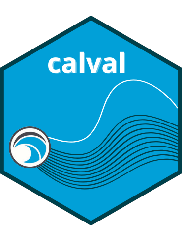
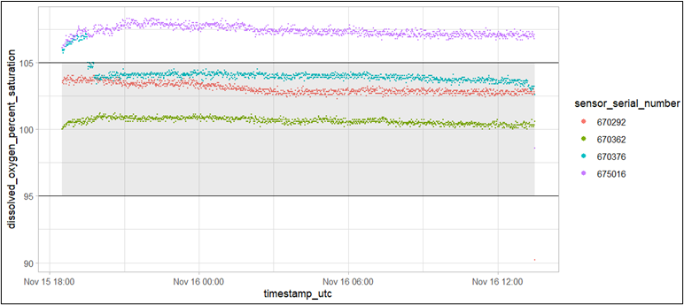

<!-- README.md is generated from README.Rmd. Please edit that file -->

# calval



<!-- badges: start -->

[](https://www.gnu.org/licenses/gpl-3.0)
[](https://github.com/ntorrie/calval/actions/workflows/R-CMD-check.yaml)
<!-- badges: end -->

The `calval` package contains a collection of functions to assist with
the flagging and visualization of validation data collected during
quality assurance testing of CMAR Coastal Monitoring Program sensors.
Sensor testing occurs prior to sensor deployment to ensure sensors are
recording within an appropriate range for each variable. Testing is
repeated after sensors are retrieved from deployment to check for sensor
drift and biofouling impacts.

`calval` is compatible with the following sensor models:

Table 1. Compatible Sensor Models

| Sensor                                                                                                | Variable(s) Measured                             |
|:------------------------------------------------------------------------------------------------------|:-------------------------------------------------|
| [aquaMeasure DOT](https://www.innovasea.com/wp-content/uploads/2023/12/AQI_Spec_Sheet.08.12.23.pdf)   | Temperature, Dissolved Oxygen Percent Saturation |
| [aquaMeasure SAL](https://www.innovasea.com/wp-content/uploads/2023/12/AQI_Spec_Sheet.08.12.23.pdf)   | Temperature, Salinity                            |
| [Vemco VR2AR & VR2AR-X](https://go.innovasea.com/vr2ar_manual.pdf)                                    | Temperature                                      |
| [Hobo DO U26-001](https://www.onsetcomp.com/resources/documentation/15603-e-man-u26x)                 | Temperature, Dissolved Oxygen mg/L               |
| [Hobo Temp U22-001](https://www.onsetcomp.com/resources/documentation/21537-mx2203-and-mx2204-manual) | Temperature                                      |

## Installation

You can install the development version of `calval` from
[GitHub](https://github.com/) with:

``` r
# install.packages("devtools")
devtools::install_github("ntorrie/calval")
```

## Pre-Deployment Validation Tests

Prior to deployment, sensors that can be calibrated are calibrated
according to their specific sensor manual. Each sensor is then subjected
to a validation test for each variable that it measures.

### Test 1

The first validation test (Test 1) evaluates accuracy of dissolved
oxygen percent saturation measurements. For a validation test of
dissolved oxygen percent saturation, sensors are set to record at 10
minute intervals and placed in an air-tight environment with
water-saturated air at 100 % humidity. The sensors are left to record
for a minimum of 6 hours (Figure 1). Upon completion of the validation
tests, data from each sensor are offloaded and evaluated using the
`calval` package functions.


Figure 1. Dissolved oxygen percent saturation test environment (Test 1)
<br> <br>

The precision for these dissolved oxygen sensors is +/-5 % (InnovaSea
2021). Since the the sensors in the test environment are in
water-saturated air, they should measure 100 +/-5 % saturation. Any
sensors which record observations outside of the acceptable 95 - 105 %
range for \> 10 % of the test duration require re-calibration and
re-validation. If a sensor fails more than 2 consecutive validation
tests it will be sent back to the manufacturer for troubleshooting.
Sensors that pass the tests are cleared for deployment.


Figure 2. Visualizing results of a dissolved oxygen percent saturation
test for four sensors. Sensor 675016 recorded outside of an acceptable
range for 99.9% of the test period, and was therefore flagged for
re-calibration and further testing.

### Test 2a or 2b

After Test 1 is completed (when applicable), the second validation test
begins. Test 2 evaluates accuracy of temperature, dissolved oxygen mg/L
(when applicable), and salinity (when applicable) measurements. If no
salinity sensors are present in the test batch, all sensors undergo Test
2a only. If salinity sensors are present in the test batch, all sensors
undergo Test 2b only.

For validation Test 2a (evaluating temperature and dissolved oxygen
measured in mg/L (when applicable)), sensors are set to record at 10 -
15 minute intervals and submerged in a well insulated tank of fresh
water for a minimum of 12 hours. For validation Test 2b (evaluating
salinity, temperature, and dissolved oxygen measured in mg/L (when
applicable)), the same test setup and duration is used as in Test 2a,
except sea water is used instead of fresh water. A minimum of 4 sensors
are required in the test batch to ensure a valid test for both Test 2a
and 2b. When possible, a mix of sensor types are included in each test
batch.

Upon completion of Test 2a or 2b, data from each sensor are offloaded
and evaluated using the `calval` package functions. For each variable,
an acceptable observation should fall within the range of median
observation +/- the sensor-specific accuracy range. The accuracy range
for each sensor type varies slightly. Any sensor that records outside of
the acceptable range for \> 10 % of the test duration will be
re-calibrated (when applicable) and re-validated. If a sensor fails more
than 2 consecutive validation tests it will be sent back to the
manufacturer for troubleshooting. Sensors that pass the tests are
cleared for deployment.

## Post-Deployment Validation Tests

After sensors are retrieved from deployment, they undergo
post-deployment validation testing following the same procedures as the
pre-deployment validation tests. Results from the post-deployment
validation tests indicate whether the sensor data recorded during the
sensor deployment may have been impacted by sensor drift or biofouling.

## Validation Test Summary Table

Table 2. Validation Test Details

| Test    | Test Environment                                                                        | Minimum Test Duration | Variable(s) Tested | Unit                           | Validation Algorithm                                            | Loggers Tested                                                                                   |
|:--------|:----------------------------------------------------------------------------------------|:----------------------|:-------------------|:-------------------------------|:----------------------------------------------------------------|:-------------------------------------------------------------------------------------------------|
| Test 1  | Air-tight environment with water saturated air at 100% humidity. Sensors not submerged. | 6 hours               | dissolved oxygen   | percent saturation             | 100% dissolved oxygen +/- sensor accuracy range                 | aquaMeasure DOT                                                                                  |
| Test 2a | Insulated tank of fresh water. Sensors fully submerged.                                 | 12 hours              | temperature        | degrees celsius                | Median temperature +/- sensor accuracy range                    | aquaMeasure DOT, Hobo DO U26-001, Hobo Temp U22-001, Vemco VR2AR, Vemco VR2AR-X                  |
| Test 2a | Insulated tank of fresh water. Sensors fully submerged.                                 | 12 hours              | dissolved oxygen   | mg/L                           | Median dissolved oxygen concentration +/- sensor accuracy range | Hobo DO U26-001                                                                                  |
| Test 2b | Insulated tank of sea water. Sensors fully submerged.                                   | 12 hours              | temperature        | degrees celsius                | Median temperature +/- sensor accuracy range                    | aquaMeasure DOT, Hobo DO U26-001, Hobo Temp U22-001, Vemco VR2AR, Vemco VR2AR-X, aquaMeasure SAL |
| Test 2b | Insulated tank of sea water. Sensors fully submerged.                                   | 12 hours              | dissolved oxygen   | mg/L                           | Median dissolved oxygen concentration +/- sensor accuracy range | Hobo DO U26-001                                                                                  |
| Test 2b | Insulated tank of sea water. Sensors fully submerged.                                   | 12 hours              | salinity           | practical salinity units (PSU) | Median salinity +/- sensor accuracy range                       | aquaMeasure SAL                                                                                  |
